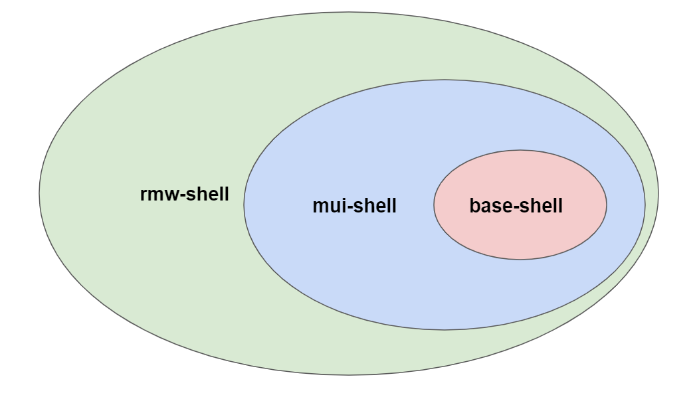

# Concept

React Most Wanted is based on **3 layers/shells**:

* **base-shell** - The base for every RMW project. It includes the management of the \`Auth\` state, Internationalization state, the basic UI Layout, and the routing.
* **mui-shell** -  This layer includes Material-UI design into the base-shell with handy components like Page, a responsive Menu, and settings for language.
* **rmw-shell** - This layer includes all the features from the previous ones and adds integration to Firebase by providing handy tools to kick start a new React project with the full power of Firebase.

